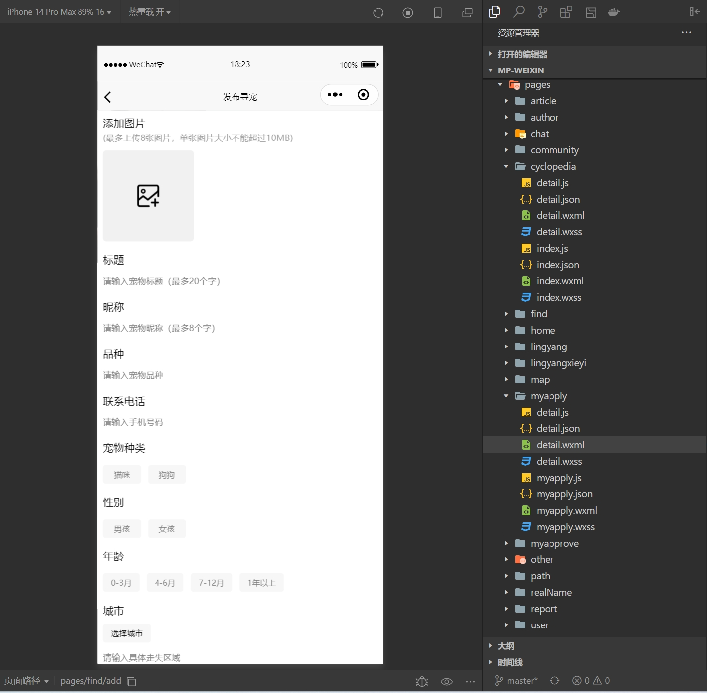

## 基于Java+Springboot+Vue的宠物领养社区小程序(源码+数据库)112

## 一、系统介绍
本系统前后端分离带小程序

小程序（用户端），后台管理系统（管理员）

- 小程序：
登录、注册、宠物领养、发布寻宠、发布领养、宠物社区、宠物评论、发布动态、领养审批、我的收藏、我的关注、举报。

- 管理后台：
用户管理、角色管理、菜单管理、宠物领养管理、答题管理、寻宠管理、动态管理、文章管理、积分管理，宠物科普管理、聊天管理、评论管理。

## 二、所用技术
后端技术栈：
- Springboot
- SpringMvc
- mybatisPlus
- mysql
- redis
- jwt
- SpringSecurity

前端技术栈：
- Vue
- elementui
- vue-router
- axios
- uniapp
- 微信小程序

## 三、环境介绍
基础环境 :IDEA/eclipse, JDK 1.8, Mysql5.7及以上, Node.js(14.21), Maven3.6, Vscode, hbuilder, 微信开发者工具, redis5.0

所有项目以及源代码本人均调试运行无问题 可支持远程调试运行

## 四、页面截图
### 1、小程序app页面

### 2、管理员页面

## 五、浏览地址

- 后台管理访问路径：http://localhost:99
  admin/123456

## 六、安装教程

1. 使用Navicat或者其它工具，在mysql中创建对应名称的数据库，并执行项目的sql

2. 使用IDEA/Eclipse导入pet-life-admin项目，导入时，若为maven项目请选择maven; 等待依赖下载完成

3. 修改ruoyi-admin目录的resources目录下面application.yml里面的redis配置, 文件路径配置,application-druid.yml里面的数据库配置

4. ruoyi-admin/src/main/java/com/ruoyi/RuoYiApplication.java启动管理后端

5. vscode或idea打开pet-admins-vue项目

6. 在编译器中打开terminal，执行npm install 依赖下载完成后执行 npm run dev,执行成功后会显示后台管理访问地址

7. 使用IDEA/Eclipse导入pet-life-main项目，导入时，若为maven项目请选择maven; 等待依赖下载完成

8. 修改resources目录下面application-dev.yml里面的数据库配置,redis配置, 文件路径配置和微信小程序配置

9. com/lian/pet/PetApplication.java启动小程序后端

10. hbuilder打开pet-wx-uniapp项目, 修改manifest.json里面的微信小程序配置AppId(从注册的微信小程序账号里面复制)

11. hbuilder点击运行-运行到小程序模拟器-微信开发者工具，然后会打开微信开发者工具，小程序页面就展示出来了(如果没有微信小程序开发工具也可以运行到浏览器打开)

